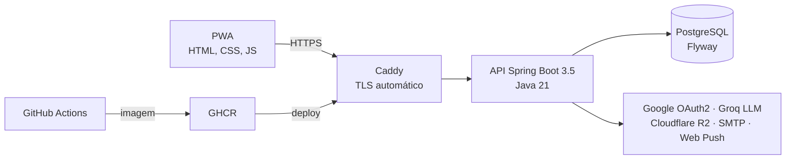

<h1 align="center">Gildean Monteiro</h1>

  <b>Desenvolvedor Full Stack · Java, Spring Boot, Cloud e Segurança</b> 
  Petrópolis, RJ · Aberto a estágio e vagas júnior (presencial, híbrido ou remoto)

  
  
  
  

---

## Sobre mim

Construo, **protejo** e mantenho sistemas reais no ar. Sou estudante de Tecnologia da Informação e Comunicação na **FAETERJ Petrópolis** (último período) e idealizei, desenvolvi e opero o **Hub Atlética Dragões**, plataforma em produção usada pelos alunos do curso. Faço o ciclo completo: modelagem do banco, back-end, interface, servidor, CI/CD e deploy.

- 🔐 **Segurança como diferencial:** certificação em Ethical Hacking (HackerX) e formação em Cibersegurança pelo **Hackers do Bem (MCTI/RNP)**
- 🧪 **Qualidade antes do deploy:** testes automatizados, migrações ensaiadas em cópia do banco e rollback por versão
- 🗣️ **Comunicação e liderança:** ex-subgerente de operação com 700+ clientes/dia, Conselheiro Acadêmico e Presidente da Atlética Dragões
- 🌎 **Inglês C2** (EF SET 82/100)

---

## ⭐ Projeto em destaque: Hub Atlética Dragões

> Plataforma dos alunos de TIC da FAETERJ: notas e simulador de aprovação, cronograma, conteúdos de estudo, carteirinha digital com QR verificável, reserva de salas, campeonatos de e-sports e assistente com IA.

<table>
  <tr>
    <td align="center"><b>80+</b> contas ativas</td>
    <td align="center"><b>1.275</b> testes automatizados</td>
    <td align="center"><b>~290</b> endpoints REST</td>
    <td align="center"><b>46</b> migrações Flyway</td>
    <td align="center"><b>R$ 170 → R$ 0</b> custo mensal após migrar AWS → Oracle Cloud</td>
  </tr>
</table>

**Segurança aplicada:** JWT + BCrypt, OAuth2, rotas protegidas por padrão, rate limiting, CSP/HSTS, defesa contra XSS e SQL injection, exportação e exclusão de dados do titular (LGPD).

🔗 **No ar:** [atleticadragoes.com.br](https://atleticadragoes.com.br) (modo visitante, sem login)
🔒 O código é privado porque o sistema guarda dados de alunos reais. Apresento arquitetura e código em entrevista técnica.

---

## 🧩 Outros projetos

| Projeto | O que é | Stack |
|---|---|---|
| **OmniRate** | Plataforma de avaliações de cultura pop (filmes, séries, jogos, livros, álbuns e HQs) com autenticação JWT e aceite de termos conforme a LGPD; publicada na Oracle Cloud | Java 21 · Spring Boot · React 18 · PostgreSQL · Docker · Caddy |
| **DocSage** *(em desenvolvimento)* | Aplicação RAG para perguntar sobre documentos, com busca semântica por embeddings | Python · FastAPI · pgvector · API da Anthropic |
| [**Portfólio**](https://github.com/Everett-gi/portfolio) | Site bilíngue sem dependências nem build, com cabeçalhos de segurança (CSP, HSTS, X-Frame-Options) | HTML · CSS · JavaScript · Vercel |

---

## 🛠️ Stack

**Back-end**
 

**Front-end**
 

**Dados**
 

**Cloud & DevOps**
 

**Segurança & IA**
 

---

## 🎓 Formação e certificações

- **Tecnologia da Informação e Comunicação** · FAETERJ Petrópolis (em curso, último período)
- **Formação em Cibersegurança** · Hackers do Bem, MCTI/RNP (em curso desde abr/2026)
- **Ethical Hacking & Cybersecurity** · HackerX (2026): Pentest, OWASP Top 10, OSINT, XSS, SQL injection, MITM
- **Residência em TIC** · Serratec (2025): Python, IoT, IA e Cloud
- **Formação Iniciante em Programação G8** · Oracle Next Education + Alura (2025)
- **Inglês C2 Proficient** · EF SET 82/100

📜 [Ver os 40+ certificados](https://portfolio-ten-livid-56.vercel.app/certificados.html)

---

🇺🇸 <b>English version</b>

 

**Full Stack Developer · Java, Spring Boot, Cloud & Security** · Petrópolis, Brazil · Open to internships and junior roles (on-site, hybrid or remote).

I build, **secure** and run real systems in production. Final-semester Information and Communication Technology student at FAETERJ. I designed, built and operate **Hub Atlética Dragões**, a production platform used by 80+ students: Java 21 and Spring Boot 3.5, PostgreSQL with 46 Flyway migrations, a vanilla JS PWA, Docker and Caddy on Oracle Cloud, CI/CD with GitHub Actions and GHCR. It ships with **1,275 automated tests** and ~290 REST endpoints, and migrating from AWS to Oracle Cloud cut hosting costs to zero.

Certified in Ethical Hacking (HackerX), currently in the Hackers do Bem cybersecurity program (MCTI/RNP). Former assistant manager of a 700+ customers/day operation. English: C2 (EF SET 82/100).

📄 [Resume (PDF)](https://portfolio-ten-livid-56.vercel.app/curriculo/Gildean_Monteiro_Resume_EN.pdf) · 💼 [LinkedIn](https://www.linkedin.com/in/gm-nascimento) · ✉️ gmonteiro0808@gmail.com

---

<picture>
  <source media="(prefers-color-scheme: dark)" srcset="https://raw.githubusercontent.com/Everett-gi/Everett-gi/output/github-snake-dark.svg">
  
</picture>
